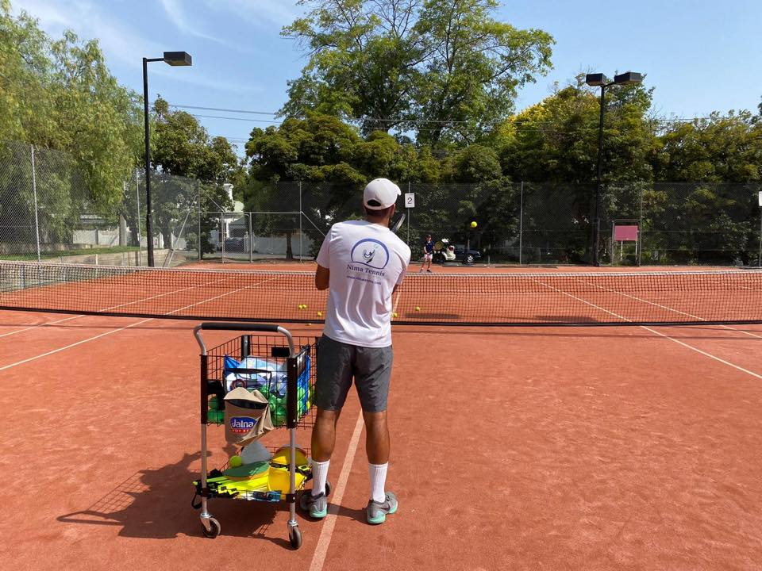

# Coaching

## Coaching by Nima Tennis

Coaching at Canterbury Tennis Club is conducted by [Nima Tennis](https://www.nimatennis.com).

Nima Tennis is led by former world top 200 Nima Roshan.  Nima and his team deliver world class tennis programs and services for players of any age and level.

Nima Tennis **Junior Programs** includes Red, Orange, Green and Yellow ball stages plus Tournament Training, School Holiday and Kindy Tennis.

Nima Tennis **Adult Programs** includes Ladies Morning Tennis, Friday Night Lights, Night Comp Training, and Team Practices.

Nima Tennis also conducts **Private Lessons** with world-class instruction to help you achieve your personal goals.

Please visit the Nima Tennis website for all the latest information:

<a href="https://www.nimatennis.com" class="button fit special" style="width: 30%; min-width: min-content" target="_blank">Nima Tennis</a>

